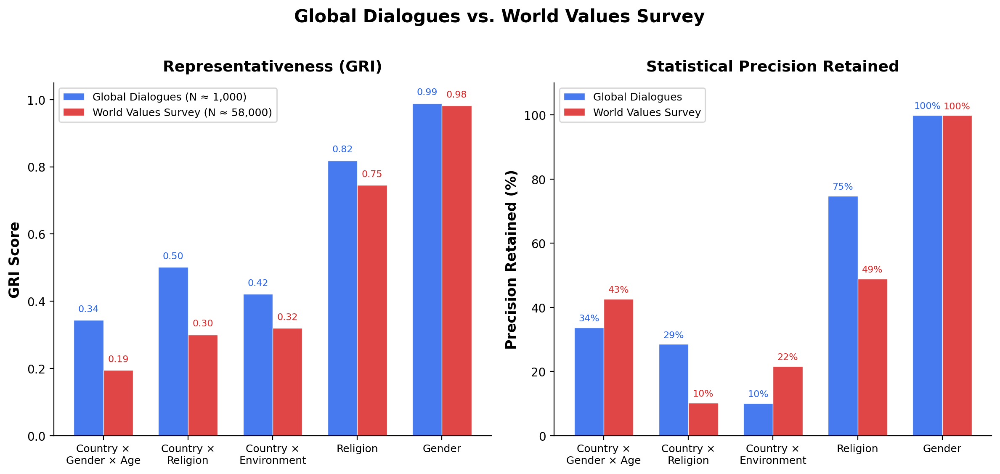

::: {.hero-banner}
# Global Representativeness Index (GRI)

A rigorous, open-source framework for measuring survey representativeness and its statistical consequences.

::: {.badge-row}
[](https://github.com/collect-intel/gri/blob/main/LICENSE)
[](https://github.com/collect-intel/gri)
[](#)
:::
:::

## The Problem

Large-scale surveys increasingly inform AI policy, technology design, and global governance. Yet there is no standardized way to measure *how representative* these samples actually are---or what the statistical consequences of non-representativeness are. A survey of 60,000 people sounds authoritative, but if its demographic composition diverges from the global population, post-stratification reweighting inflates variance and the **effective sample size** may be a fraction of the nominal count.

The GRI framework provides both a **representativeness score** and a concrete measure of **inferential cost**: how much statistical precision a survey loses due to demographic mismatch.

## The Framework

### GRI: Measuring Representativeness

::: {.formula-box}
$$
\text{GRI} = 1 - \text{TVD}(p, q) = 1 - \frac{1}{2} \sum_{i=1}^{k} |p_i - q_i|
$$
:::

The GRI is built on **Total Variation Distance (TVD)**, the largest possible difference between the probabilities that two distributions assign to any event. The complement maps this to a 0--1 scale where **1.0 = perfect representation** and **0.0 = complete mismatch**.

### Design Effect: The Precision Cost

When a survey's demographic composition differs from the population, analysts must reweight responses---and reweighting inflates variance. The **design effect** quantifies this cost:

::: {.formula-box}
$$
d_{\text{eff}} = \sum_{i \in S} \frac{\hat{q}_i^2}{p_i}, \qquad N_{\text{eff}} = \frac{N}{d_{\text{eff}}}
$$
:::

where $\hat{q}_i$ is the renormalized population weight over represented strata. A design effect of 3.0 means a survey of 1,000 respondents has the statistical power of only ~333 optimally allocated respondents. The **precision retained** ($1 / d_{\text{eff}}$) tells you what fraction of your sample budget is actually contributing to inferential precision.

**GRI tells you how representative your survey is. Design effect tells you what that costs.**

## Key Results

### Global Dialogues vs. World Values Survey

We benchmark the GRI against two major survey programs: [Global Dialogues](https://global-dialogues.ai/) (~1,000 participants per wave, deliberately designed for global representation) and the [World Values Survey](https://www.worldvaluessurvey.org/) (~58,000 participants per wave, convenience-sampled across countries).

{.figure width="100%"}

### Primary Dimensions: GD1--GD6

| Dimension | GRI | Design Effect | Effective N | Precision Retained |
|:---|:---:|:---:|:---:|:---:|
| Country x Gender x Age | 0.34 | 3.0 | 189 | 34% |
| Country x Religion | 0.50 | 4.1 | 241 | 29% |
| Country x Environment | 0.42 | 10.9 | 102 | 10% |
| Continent | 0.83 | 1.1 | 965 | 89% |
| Gender | 0.99 | 1.0 | 1,083 | 100% |

: GD averages across 6 waves (N ≈ 1,000 per wave). {.results-table}

### The Same Dimensions: WVS (W1--W7)

| Dimension | GRI | Design Effect | Effective N | Precision Retained |
|:---|:---:|:---:|:---:|:---:|
| Country x Gender x Age | 0.20 | 2.7 | 5,695 | 43% |
| Country x Religion | 0.30 | 29.4 | 3,634 | 10% |
| Country x Environment | 0.32 | 45.4 | 5,832 | 22% |
| Continent | 0.67 | 1.6 | 40,371 | 66% |
| Gender | 0.98 | 1.0 | 57,550 | 100% |

: WVS averages across 7 waves (N ≈ 58,000 per wave). {.results-table}

### What This Reveals

- **Deliberate design beats raw sample size.** Global Dialogues achieves GRI scores 40--70% higher than WVS on intersectional dimensions with 1/58th the participants.
- **WVS's sample size advantage is largely consumed by reweighting.** On Country x Religion, WVS averages a design effect of 29.4---meaning its ~58,000 respondents yield the precision of ~3,600 optimally allocated respondents.
- **Both surveys pay a precision cost on intersectional dimensions.** Even GD retains only 10--34% of its nominal precision on primary dimensions, highlighting the fundamental difficulty of simultaneously matching multiple demographic distributions.
- **Single-axis dimensions are well-served by both.** Gender balance is near-perfect in both programs (GRI > 0.98, precision retained ~100%).

See the [full results](results.qmd) for all 13 dimensions across all waves.

## Quick Start

```python
pip install gri
```

```python
from gri import GRIScorecard

scorecard = GRIScorecard()
results = scorecard.generate_scorecard(survey_df, base_path="path/to/gri")

# Results include GRI, Design Effect, Effective N, and Precision Retained
# for every dimension
```

See the [library documentation](library.qmd) for the full API reference and examples.

## Learn More

- [Methodology](methodology.qmd) --- TVD framework, design effect, multi-dimensional scorecards, maximum achievable scores
- [Results](results.qmd) --- Complete benchmark results from Global Dialogues and the World Values Survey
- [Python Library](library.qmd) --- Installation, API reference, and usage examples
- [About](about.qmd) --- Citation, authors, license, and data sources
