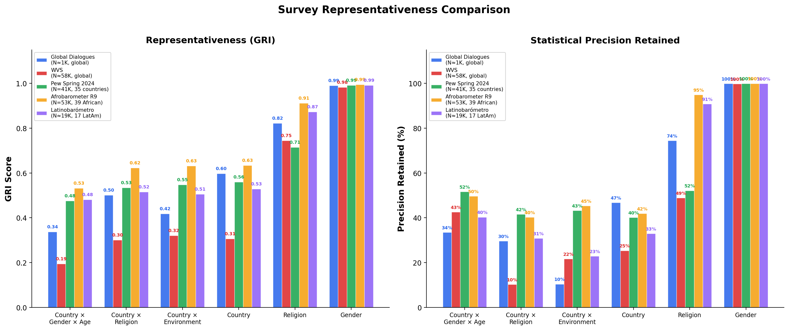

::: {.hero-banner}
# Global Representativeness Index (GRI)

A rigorous, open-source framework for measuring survey representativeness and its statistical consequences.

::: {.badge-row}
[](https://github.com/collect-intel/gri/blob/main/LICENSE)
[](https://github.com/collect-intel/gri)
[](#)
:::
:::

## The Problem

Large-scale surveys increasingly inform AI policy, technology design, and global governance. Yet there is no standardized way to measure *how representative* these samples actually are---or what the statistical consequences of non-representativeness are. A survey of 60,000 people sounds authoritative, but if its demographic composition diverges from the global population, post-stratification reweighting inflates variance and the **effective sample size** may be a fraction of the nominal count.

The GRI framework provides both a **representativeness score** and a concrete measure of **inferential cost**: how much statistical precision a survey loses due to demographic mismatch.

## The Framework

### GRI: Measuring Representativeness

::: {.formula-box}
$$
\text{GRI} = 1 - \text{TVD}(p, q) = 1 - \frac{1}{2} \sum_{i=1}^{k} |p_i - q_i|
$$
:::

The GRI is built on **Total Variation Distance (TVD)**, the largest possible difference between the probabilities that two distributions assign to any event. The complement maps this to a 0--1 scale where **1.0 = perfect representation** and **0.0 = complete mismatch**.

### Design Effect: The Precision Cost

When a survey's demographic composition differs from the population, analysts must reweight responses---and reweighting inflates variance. The **design effect** quantifies this cost:

::: {.formula-box}
$$
d_{\text{eff}} = \sum_{i \in S} \frac{\hat{q}_i^2}{p_i}, \qquad N_{\text{eff}} = \frac{N}{d_{\text{eff}}}
$$
:::

where $\hat{q}_i$ is the renormalized population weight over represented strata. A design effect of 3.0 means a survey of 1,000 respondents has the statistical power of only ~333 optimally allocated respondents. The **precision retained** ($1 / d_{\text{eff}}$) tells you what fraction of your sample budget is actually contributing to inferential precision.

The critical distinction: **GRI treats overrepresentation and underrepresentation symmetrically** --- sampling 5% too many or 5% too few in a stratum contributes equally to GRI. **Design effect is asymmetric** --- underrepresentation is far more expensive than overrepresentation, because the few respondents in underrepresented strata must be upweighted, amplifying their noise. Overrepresented strata are merely downweighted, wasting data but not destroying precision. This is why two surveys with similar GRI scores can have very different effective sample sizes.

## Key Results

### Comparing Five Major Survey Programs

We benchmark the GRI against five survey programs spanning different design philosophies, geographic scopes, and sample sizes:

| Survey | N | Scope | Benchmark |
|:---|---:|:---|:---|
| [Global Dialogues](https://global-dialogues.ai/) (GD1--GD8) | ~1,000/wave | Global (50+ countries) | Global population |
| [World Values Survey](https://www.worldvaluessurvey.org/) (W1--W7) | ~58,000/wave | Global (60--100 countries) | Global population |
| [Pew Global Attitudes](https://www.pewresearch.org/global/) (Spring 2024) | 41,483 | 35 countries worldwide | 35-country population |
| [Afrobarometer](https://www.afrobarometer.org/) (Round 9) | 53,444 | 39 African countries | 39-country population |
| [Latinobarómetro](https://www.latinobarometro.org/) (2023--2024) | ~19,200/wave | 17 Latin American countries | 17-country population |

: {.results-table}

::: {.callout-note}
## Claimed representativeness, not global representativeness

The GRI measures how well a survey represents its **claimed population**. Regional surveys like Afrobarometer and Latinobarómetro are benchmarked against the populations of the countries they target---not against the entire world. This makes scores comparable across programs: a GRI of 0.80 means "80% representative of the population you claim to cover," whether that population is global or regional.
:::

{.figure width="100%"}

### GRI Scores Across Programs

| Dimension | GD (global) | WVS (global) | Pew (35 countries) | Afrobarometer (39 African) | Latinobarómetro (17 LatAm) |
|:---|:---:|:---:|:---:|:---:|:---:|
| Country x Gender x Age | 0.34 | 0.20 | 0.48 | 0.53 | 0.48 |
| Country x Religion | 0.50 | 0.30 | 0.53 | 0.62 | 0.52 |
| Country x Environment | 0.42 | 0.32 | 0.55 | 0.63 | 0.51 |
| Country | 0.60 | 0.31 | 0.56 | 0.63 | 0.53 |
| Religion | 0.82 | 0.75 | 0.72 | 0.91 | 0.87 |
| Gender | 0.99 | 0.98 | 0.99 | 0.99 | 0.99 |
| **Overall (13 dim. avg)** | **0.64** | **0.55** | **0.69** | **0.81** | **0.78** |

: GD and WVS averaged across waves. Latinobarómetro averaged across 2023--2024. {.results-table}

### What This Reveals

- **Deliberate design beats raw sample size.** Global Dialogues achieves GRI scores 40--70% higher than WVS on intersectional dimensions with 1/58th the participants.
- **Regional surveys score well against their claimed populations.** Afrobarometer (Overall 0.81) and Latinobarómetro (0.78) achieve strong representativeness *of the populations they target*---but would score much lower against global benchmarks, as expected.
- **Pew's equal-per-country design limits country-level GRI.** With ~1,000 respondents per country regardless of population, India (1.4B) and Singapore (5.8M) get equal weight, producing a Country GRI of only 0.56 despite 41K total respondents.
- **All surveys pay a precision cost on intersectional dimensions.** Even the best-performing programs retain only 30--50% of nominal precision on Country x Gender x Age, highlighting the combinatorial difficulty of simultaneously matching multiple distributions.
- **Gender balance is near-perfect across all programs** (GRI > 0.98), confirming that binary gender matching is a solved problem in modern survey design.

See the [full results](results.qmd) for all 13 dimensions across all waves and programs.

## Quick Start

```python
pip install gri
```

```python
from gri import GRIScorecard

scorecard = GRIScorecard()
results = scorecard.generate_scorecard(survey_df, base_path="path/to/gri")

# Results include GRI, Design Effect, Effective N, and Precision Retained
# for every dimension
```

See the [library documentation](library.qmd) for the full API reference and examples.

## Learn More

- [Methodology](methodology.qmd) --- TVD framework, design effect, multi-dimensional scorecards, maximum achievable scores
- [Results](results.qmd) --- Complete benchmark results from Global Dialogues, World Values Survey, Pew Global Attitudes, Afrobarometer, and Latinobarómetro
- [Python Library](library.qmd) --- Installation, API reference, and usage examples
- [About](about.qmd) --- Citation, authors, license, and data sources
