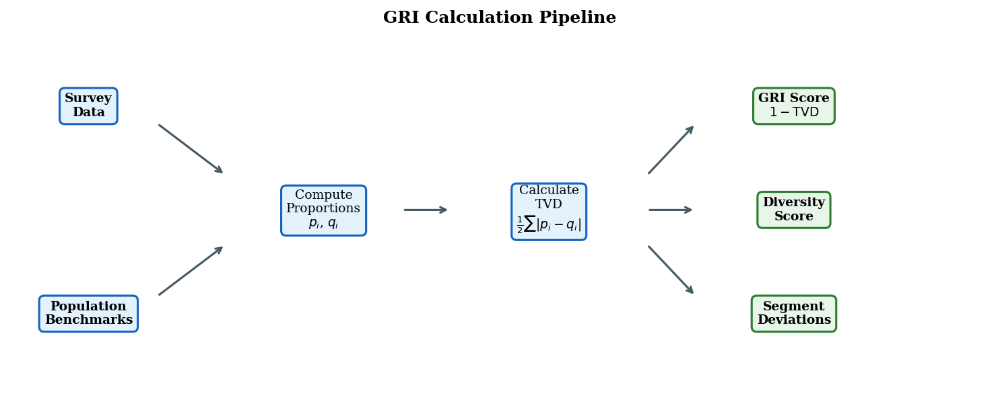
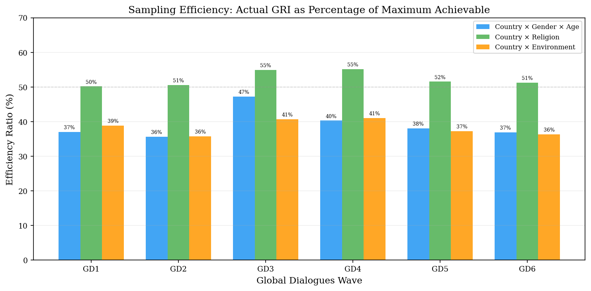

## Total Variation Distance

The GRI is built on **Total Variation Distance (TVD)**, one of the most fundamental metrics in probability theory. For discrete distributions $P$ and $Q$ over a shared set of categories:

$$
\text{TVD}(P, Q) = \frac{1}{2} \sum_{i=1}^{k} |p_i - q_i|
$$

TVD has several properties that make it ideal for representativeness measurement:

- **Bounded**: Always in $[0, 1]$, enabling direct comparison across dimensions and surveys
- **Metric**: Satisfies non-negativity, symmetry, and the triangle inequality
- **Interpretable**: Equals the maximum difference in probability assigned to any event
- **Distribution-free**: No parametric assumptions required
- **Additive sensitivity**: Every stratum contributes proportionally to the total distance

## GRI Calculation

The GRI is defined as the complement of TVD:

$$
\text{GRI}(p, q) = 1 - \text{TVD}(p, q) = 1 - \frac{1}{2} \sum_{i=1}^{k} |p_i - q_i|
$$

This maps to a 0--1 scale where **1.0 = perfect match** and **0.0 = complete mismatch**.

### Calculation Pipeline

{.figure width="100%"}

**Inputs:**

1. **Survey data** --- one row per respondent with demographic columns (country, gender, age group, religion, environment type)
2. **Population benchmarks** --- global demographic proportions from authoritative sources

**Process:**

1. Cross demographic columns to form strata (e.g., "India x Female x 25--34")
2. Compute sample proportions $p_i$ for each stratum
3. Look up population proportions $q_i$ from benchmarks
4. Calculate TVD and convert to GRI

## Diversity Score

The GRI captures *how closely* the sample matches the population, but not *how many* population segments are represented at all. The **Diversity Score** fills this gap:

$$
\text{Diversity} = \frac{|\{i : p_i > 0 \text{ and } q_i \geq X\}|}{|\{i : q_i \geq X\}|}
$$

where $X = \frac{1}{2N}$ is a dynamic relevance threshold that scales with sample size. This measures the fraction of meaningfully-sized population strata that appear at least once in the sample.

## Multi-Dimensional Scorecard

The GRI is computed across **13 dimensions** organized in three tiers:

### Primary Dimensions (intersectional)
These combine geography with demographics, producing the finest-grained assessment:

| Dimension | Strata Count | Benchmark Source |
|:---|---:|:---|
| Country x Gender x Age | 2,699 | UN WPP 2023 |
| Country x Religion | 1,607 | Pew GLS 2010 |
| Country x Environment | 449 | UN WUP 2018 |

### Regional Dimensions (intermediate)
Replace countries with 20 world regions, reducing cardinality:

- Region x Gender x Age, Region x Religion, Region x Environment, Region (alone)

### Single-Axis Dimensions (marginal)
Assess one demographic factor at a time:

- Country, Continent, Religion, Environment, Age Group, Gender

Each dimension tells a different story. A survey might achieve strong continental representation (GRI = 0.88) while poorly representing the Country x Gender x Age intersection (GRI = 0.37)---the scorecard makes these trade-offs transparent.

## Maximum Achievable Scores

With thousands of strata and finite samples, perfect GRI scores are mathematically impossible. We use **Monte Carlo simulation** to estimate the maximum achievable GRI at any sample size by generating optimally-allocated samples.

At $N = 1{,}000$:

| Dimension | Max GRI | Max Diversity |
|:---|:---:|:---:|
| Country x Gender x Age | 0.792 | 0.925 |
| Country x Religion | 0.938 | 0.970 |
| Country x Environment | 0.950 | 0.977 |

These ceilings enable **efficiency ratios**---the percentage of the theoretical maximum that a real survey achieves---providing a fairer basis for comparison than raw scores alone.

{.figure width="100%"}

## Design Effect and Effective Sample Size

The GRI measures *how far* a sample deviates from the population. The **design effect** answers the next question: *what does that deviation cost?*

When a survey's demographic composition differs from the population, analysts must post-stratify---reweight responses so that each stratum contributes proportionally to its population share. Reweighting inflates variance, because over-represented strata get downweighted (wasting collected data) and under-represented strata get upweighted (amplifying noise).

### The Design Effect

$$
d_{\text{eff}} = \sum_{i \in S} \frac{\hat{q}_i^2}{p_i}
$$

where $p_i$ is the sample proportion and $\hat{q}_i$ is the population proportion renormalized over represented strata. When $p = q$ (perfect representation), $d_{\text{eff}} = 1$. Any deviation from the population distribution pushes $d_{\text{eff}}$ above 1.

### Effective Sample Size

$$
N_{\text{eff}} = \frac{N}{d_{\text{eff}}}
$$

This is the number of optimally-allocated respondents that would yield the same precision. A survey of 58,000 with $d_{\text{eff}} = 29$ has the same statistical power as ~2,000 optimally-allocated respondents.

### Precision Retained

$$
\text{Precision Retained} = \frac{1}{d_{\text{eff}}}
$$

This is the fraction of the sample budget that contributes to inferential precision after reweighting. When precision retained is 10%, ninety percent of the survey effort is consumed by correcting demographic mismatch.

### Why Not Just Reweight?

Reweighting can correct *estimates* of population means but cannot recover the *precision* lost to poor allocation. A survey that over-represents one country by 10x and under-represents another by 10x can be reweighted to produce unbiased estimates---but the confidence intervals will be much wider than a survey that allocated respondents proportionally. The design effect quantifies exactly how much wider.

### Relationship to GRI

GRI and design effect measure complementary aspects of representativeness:

- **GRI** captures the total demographic distance (via TVD)
- **Design effect** captures the variance inflation from that distance
- **Effective N** translates the cost into an interpretable unit

A survey can have a moderate GRI but a very high design effect if its misallocation is concentrated in a few high-population strata. Reporting both metrics gives a complete picture.

## Benchmark Data Sources

| Dataset | Source | Year | Use |
|:---|:---|:---:|:---|
| World Population Prospects | UN DESA Population Division | 2023 | Country x Gender x Age benchmarks |
| Global Religious Landscape | Pew Research Center | 2010 | Country x Religion benchmarks |
| World Urbanization Prospects | UN DESA Population Division | 2018 | Country x Environment benchmarks |

All benchmark data is included in the repository under `data/raw/benchmark_data/` with full attribution in `Sources.csv`.

### Limitations of Benchmark Data

The religious composition data from Pew dates to 2010 and may not reflect current demographics in rapidly changing regions. Urban/rural classifications use national-level data that can mask within-country variation. These limitations are inherent to the best available global demographic data and should be considered when interpreting GRI scores.
