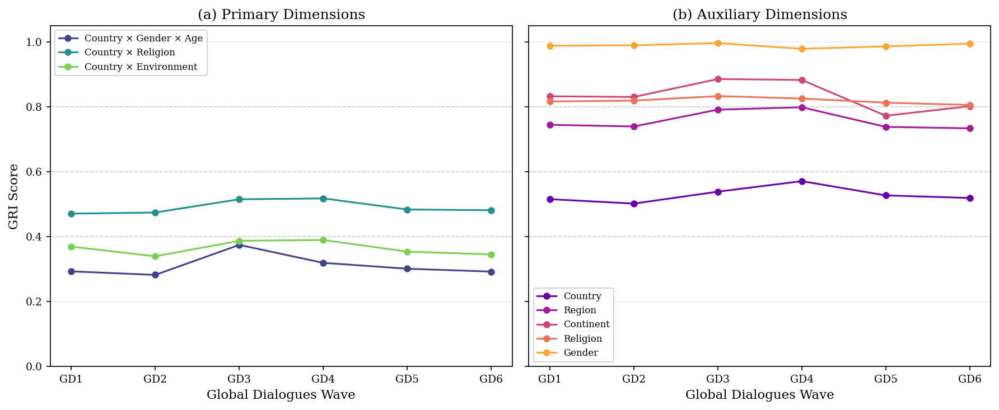
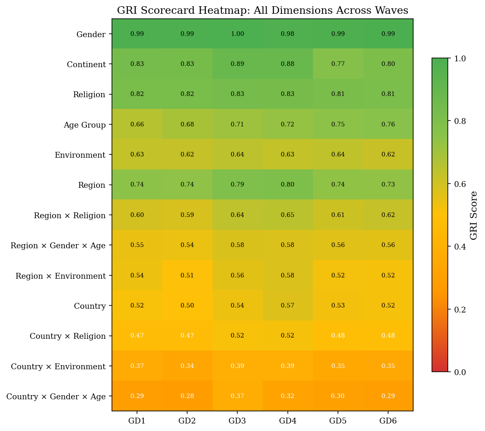

## About Global Dialogues

[Global Dialogues](https://global-dialogues.ai/) is a longitudinal survey series capturing public perceptions of AI across diverse global populations. Six waves have been conducted to date, each recruiting approximately 1,000 participants from 50+ countries.

| Wave | Participants | Period |
|:---|---:|:---|
| GD1 | 1,280 | Wave 1 |
| GD2 | 1,105 | Wave 2 |
| GD3 | 971 | Wave 3 |
| GD4 | 1,050 | Wave 4 |
| GD5 | 1,057 | Wave 5 |
| GD6 | 1,037 | Wave 6 |

These waves serve as the primary benchmark for the GRI, providing a real-world test across varying recruitment strategies and sample compositions.

## GRI Scores Across Waves

{.figure width="100%"}

### Primary Dimensions

| Dimension | GD1 | GD2 | GD3 | GD4 | GD5 | GD6 |
|:---|:---:|:---:|:---:|:---:|:---:|:---:|
| Country x Gender x Age | 0.293 | 0.282 | 0.374 | 0.319 | 0.301 | 0.292 |
| Country x Religion | 0.471 | 0.474 | 0.515 | 0.518 | 0.484 | 0.481 |
| Country x Environment | 0.369 | 0.339 | 0.387 | 0.390 | 0.354 | 0.345 |

### Regional Dimensions

| Dimension | GD1 | GD2 | GD3 | GD4 | GD5 | GD6 |
|:---|:---:|:---:|:---:|:---:|:---:|:---:|
| Region x Gender x Age | 0.545 | 0.543 | 0.580 | 0.577 | 0.563 | 0.559 |
| Region x Religion | 0.597 | 0.587 | 0.639 | 0.647 | 0.609 | 0.621 |
| Region x Environment | 0.537 | 0.507 | 0.562 | 0.576 | 0.520 | 0.518 |
| Region | 0.745 | 0.739 | 0.791 | 0.799 | 0.738 | 0.734 |

### Single-Axis Dimensions

| Dimension | GD1 | GD2 | GD3 | GD4 | GD5 | GD6 |
|:---|:---:|:---:|:---:|:---:|:---:|:---:|
| Country | 0.515 | 0.502 | 0.539 | 0.571 | 0.527 | 0.519 |
| Continent | 0.832 | 0.830 | 0.886 | 0.883 | 0.773 | 0.802 |
| Religion | 0.817 | 0.819 | 0.833 | 0.826 | 0.813 | 0.806 |
| Environment | 0.629 | 0.623 | 0.642 | 0.628 | 0.635 | 0.620 |
| Age Group | 0.656 | 0.684 | 0.706 | 0.723 | 0.746 | 0.756 |
| Gender | 0.989 | 0.990 | 0.996 | 0.979 | 0.986 | 0.995 |

## Full Scorecard Heatmap

{.figure width="100%"}

The heatmap reveals a clear gradient: single-axis dimensions (top) achieve high GRI scores, while intersectional dimensions (bottom) remain challenging. This pattern is consistent across all six waves and reflects the fundamental difficulty of simultaneously matching multiple demographic distributions with finite samples.

## Sampling Efficiency

Raw GRI scores can be misleading without context. A score of 0.30 on Country x Gender x Age sounds low, but the maximum achievable score at N = 1,000 is only 0.79. **Efficiency ratios** normalize scores against these theoretical ceilings:

{.figure width="100%"}

| Dimension | Max GRI (N=1000) | GD3 Actual | Efficiency |
|:---|:---:|:---:|:---:|
| Country x Gender x Age | 0.792 | 0.374 | 47% |
| Country x Religion | 0.938 | 0.515 | 55% |
| Country x Environment | 0.950 | 0.387 | 41% |

GD3 achieves 41--55% of the theoretical maximum across primary dimensions, indicating substantial room for improvement through targeted recruitment while also showing that current samples capture a meaningful portion of achievable representativeness.

## Key Findings

- **Gender balance is consistently strong** across all waves (GRI > 0.97), reflecting effective recruitment
- **GD3 outperforms other waves** despite having the smallest sample (N = 971), suggesting that recruitment strategy matters more than sample size alone
- **Intersectional dimensions are inherently harder** --- Country x Gender x Age scores (0.28--0.37) are much lower than single-axis scores, but this reflects the combinatorial challenge of 2,699 strata, not poor sampling
- **Age representation improves over time** --- a steady upward trend from GD1 (0.66) to GD6 (0.76) suggests iterative recruitment refinement
- **Religious representation is stable** --- Country x Religion scores hover around 0.49, constrained partly by the 2010 benchmark data

## Compare Your Survey

The GRI framework can be applied to any survey with demographic data. See the [Python library documentation](library.qmd) to calculate GRI scores for your own data.
